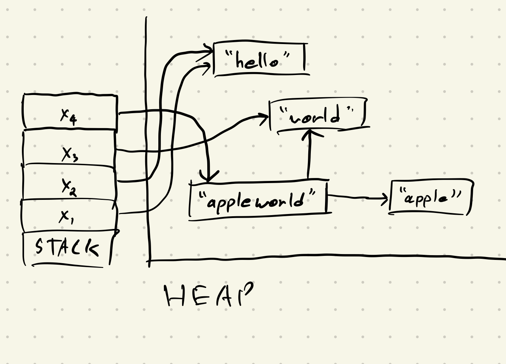
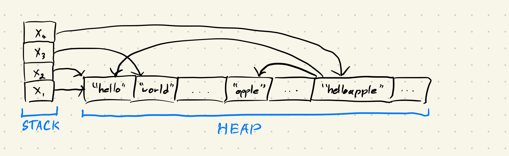

# Discussion 12 - Rust and some Garbage Collection

## Reminders
- Project 3 Due 16th (11:59 PM)
- No submission this discusison
- Final exam next week!
    - Next discussion is review: **bring questions/topics!**

## Rust Iterators
[Rust Book Chapter](https://doc.rust-lang.org/book/ch13-02-iterators.html)

What is an iterator? 

- According to MIT, it is something we can call the `.next()` method on repeatedly to yeild a sequence of things. 

What can that look like?

```rust
let mut range = 0..10;

loop {
    match range.next() {
        Some(x) => {
            println!("{}", x);
        },
        None => { break }
    }
}
```

```rust
let nums = vec![1,2,3,4,5,6,7,8,9,10];
for num in nums {
    println!("{}", num);
}

// Implicitly does this:

for num in nums.iter() {
   println!("{}", num);
}

```

```rust
let nums = vec![1,2,3,4,5,6,7,8,9,10];
for i in 0..nums.len() {
    println!("{}", nums[i]);
}
```

If we want to mutate the data while we iterate, we use iter_mut:

```rust
let nums = vec![1,2,3,4,5,6,7,8,9,10];
for element in nums.iter_mut() {
    *element += 1;
}
```

Any others?
https://play.rust-lang.org/?version=stable&mode=debug&edition=2021

## Rust Smart Pointer Example
[Rust Book Chapter](https://doc.rust-lang.org/book/ch15-05-interior-mutability.html)

`RefCell` allows us to mutate data, even when there are immutable references pointing to it. This is normally disallowed by borrowing rules, meaning that `RefCell` is **unsafe**. Borrowing rules are enforced at runtime, rather than compile time.

Quick review of the 3 smart pointers you've learned about so far: 
- Rc<T> enables multiple owners of the same data; Box<T> and RefCell<T> have single owners.
- Box<T> allows immutable or mutable borrows checked at compile time; Rc<T> allows only immutable borrows checked at compile time; RefCell<T> allows immutable or mutable borrows checked at runtime.
- Because RefCell<T> allows mutable borrows checked at runtime, you can mutate the value inside the RefCell<T> even when the RefCell<T> is immutable.

Take this new definition of a LinkedList: 
```rust
enum List {
    Cons(Rc<RefCell<i32>>, Rc<List>),
    Nil,
}
```

Compared to what we saw last week:
```rust
pub enum List {
    Cons(i32, Box<List>),
    Nil
}
```

What does this new definition allow us to do that our old one didn't, know that we know about Box, Rc, and RefCells

How we did it before (returning a new list):

```rust
    pub fn insert(self, n: i32) -> List {
        match self {
            Nil => Cons(n, Box::new(Nil)),
            Cons(x,y) => Cons(x, Box::new(y.insert(n)))
        }
    }
    
    pub fn reverse(self) -> List {
        match self {
            Nil => Nil,
            Cons(x,y) => y.reverse().insert(x)
        }
    }
```

Challenge: try to reverse this linkedlist definition in place
- helpful resource for above: https://rust-unofficial.github.io/too-many-lists/fourth-final.html


## Garbage Collection Review

* **Reference Counting** - Keep track of how many references point to a piece of memory, and free that memory once the counter reaches 0.
* **Mark & Sweep** - Has two phases, mark and sweep. In the mark phase, we mark all chunks of memory reachable via the stack. In the sweep phase, we go through the heap and deallocate all non-marked (non-reachable) chunks of memory.
* **Stop & Copy** - Similar to Mark & Sweep, but instead of freeing unreachable heap memory segments, we copy all reachable references to an alternate partition. Once all references are copied, we swap to using that partition.

Given the following memory diagrams, complete the exercises:

### Reference Counting

Consider the following stack + heap layout:




1. What would a reference counter diagram look like for this problem?
2. What would the diagram look like after the variable `x4` is popped off the stack?
   - Continue this example for `x3`, `x2`, and finally `x1`.

### Mark & Sweep

Suppose we have the following layout for the stack and heap:



1. Indicate the freed segments of memory after one pass of Mark & Sweep.
2. Remove the variable `x3` from the stack. What does the diagram look like now?
3. Remove the variables `x2` and `x1`, but keep `x3` in the stack. What does the diagram look like now?
