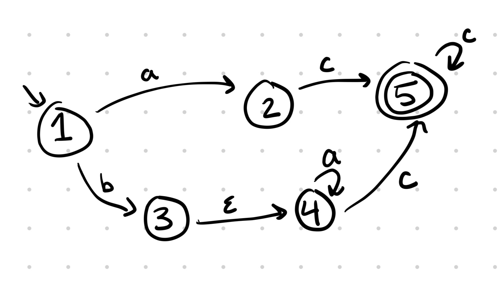

# FSM

## Reminders
1. Exam 1 on June 20 during discussion (two weeks from today!)
2. Project 1 released tomorrow and due June 18th (Tentative)

## Regex + FSM Practice Problems
1. Write a regex that represents the following: 
    - A string that has the letter 'a' one or more times, then can have the letter b once or not at all, then the letter c at least 2 times, possibly more.
    - Some accepted strings: 'aaccc' 'abcc' 'aaaaabcccccc'
    - Some *not* accepted strings: 'abbc' 'bbacc', etc.

2. Create an FSM that represents the regex written above.

3. Given the following FSM, which strings are accepted?

    - "aabc"
    - "acccccc"
    - "bbacc"
    - "baaaacc"
    - "bc"
4. Can you find a regex that represents the FSM above?

## Pokemon FSM
Let's continue our Pokemon theme!

## Regex to FSM
We said that finite state machines can be used to represent problems that can
be broken down into descrete actions and states. In this exercise, we will
be simulating a simplified form of pokemon battle

### FSM Creation

The Fsm class is the class representing Finite State Machines. It is modeled after the formal definition of a NFA, a 5-tuple (Σ, Q, q0, F, δ) where:

1. Σ is a finite alphabet,
2. Q is a finite set of states,
3. q0 ∈ Q is the start state,
4. F ⊆ Q is the set of accept states, and
5. δ : Q × (Σ ∪ {ε}) → 𝒫(Q) is the transition function (𝒫(Q) represents the powerset of Q).

We translate this definition into a Python class in a straightforward way using object oriented programming:

```python
class Fsm:
  def __init__(self,alphabet,states,start,final,transitions):
    self.sigma = sigma               # a list of characters
    self.states = states             # a list of states 
    self.start = start               # a single state
    self.final = final               # a list of states
    self.transitions = transitions   # a list of transitions
```
 We will define as a 3-tuple list. Each transition is a 3-tuple (src, action, dest) that maps a start state (src) and an action to exactly one destination state (dest). This means that that each edge in the FSM will correspond to a single transition in the list of transitions. This will make the syntax for defining FSMs cleaner and allow for a one-to-one mapping between elements of the transition list and edges in the FSM graph.

`make(file)`

Given a text file, create an FSM that will represent the series of actions of a Pokemon during a Pokemon battle. The text file will be formatted as follows:
- HP followed by a colon, followed by an arbitrary number of whitespace, and ending with a number
- The name of the action, followed by a colon, followed by an arbitrary number of whitespace, and ending with a number
- The actions will be separated by a semicolon, with an arbitrary number of whitespace between each one.

Example (pokemon1.txt):
```txt
HP: 10 ; Damage: 5 ; Heal: 5
```
The text file above will create the following FSM

```python
make(pokemon1.txt) =  FSM(["heal", "damage"], [10, 5, 0], 10, 0, [(10, "damage", 5), (5, "heal", 10), (5, "damage", 0)])
```

**Note 1**: The order of actions should not matter. `HP: 10 ; Heal: 5 ; Damage: 5` is also a valid text file.\\

**Note 2**: `make` should create the same FSM with the same inputs.


`move(action, state, FSM)`

Given an action, an inital state, and the finite state machine, return the state we can get to after starting from the initial state and making one transition with the action. If the transition does not exist, return None. You may assume the initial state is valid (i.e. a part of the FSM)

Example (Using the FSM example from before):

```python
move("damage", 10, fsm_ex) = 5
move("heal", 0, fsm_ex) = None
move("damage", 5, fsm_ex) = 0
```
`outcome(file, fsm)`

Given a text file with a series of actions, return "Alive" if the Pokemon has not reached an HP of 0, or "Fainted" if the Pokemon has reached
an HP of 0 (the final state).

The text file will be formatted as follows (actions1.txt):
```txt
damage
attack
heal
attack
damage
```

No HP is lost or gained with an attack action

Example:
```python
outcome("actions1.txt", fsm_ex) = "Alive"
outcome("actions2.txt", fsm_ex) = "Fainted"
```
