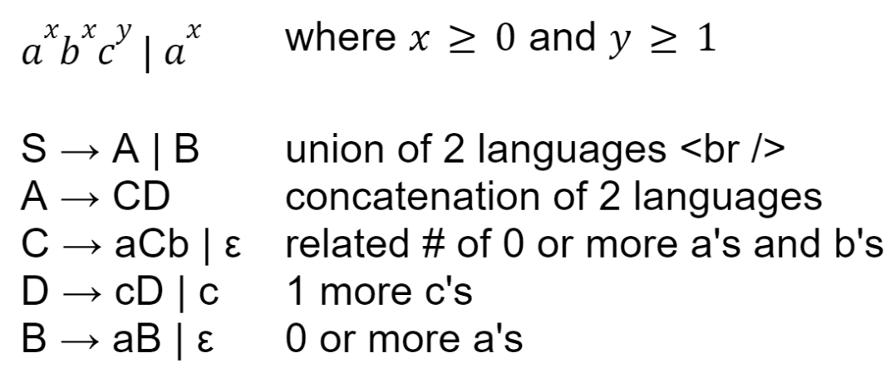

# Discussion 4 - Tuesday, June 11th

## Reminders
1. Exam 1 on June 20 during discussion (a week from thursday!)
2. Project 1 is released! It's due June 18th

## Context Free Grammars

### Regex or CFG?
Can the following be represented by a regex, CFG, or neither?
- a noun-verb-noun sentence
- grammatically correct English sentences
- palindrome (strings of any length)
- the set of all Python programs
- matching parentheses (any amount)
- email address

### Parsing Practice (Drawing ASTs)
Given the string "(4 + (5 * (6 + 7)))" and the grammar below, draw the corresponding AST and parser tree.

S -> M + S | M

M -> N * M | N

N -> n | (S)

where n is any integer

### CFG Practice
Given the following grammar:

S -> aS | T  
T -> bT | U  
U -> cU | ε  

Provide derivations for:
* b
* ac
* bbc

Describe what this grammar accepts.

### More practice

Consider the following grammars:

Grammar One  
S -> ABD | $\epsilon$  
A -> SaA | aBb  
B -> BDd | D  
D -> Dd | $\epsilon$  

Grammar Two  
S -> Sd | A  
A -> aAb | b | B  
B -> Bd | b  

Do both, one, or neither of the two grammars above accept the strings "abd", "adb", "abbd", and "abbbdd"?

### Practicing Derivations
Grammar: S -> S + S | 1 | 2 | 3

Nonterminal: S  
Terminal: 1,2,3  
Production rules: S -> S + S, S -> 1, S -> 2, S -> 3  

Leftmost derivation of 1 + 2 + 3
* Start with S and use the production rules on the LEFTMOST nonterminal ONE AT A TIME. (For a rightmost derivation, use the productions on the RIGHTMOST nonterminal.)
* ONE NONTERMINAL AT A TIME!!!! DON'T COMBINE STEPS!!!!
* S -> S + S -> S + S + S -> 1 + S + S -> 1 + 2 + S -> 1 + 2 + 3
* S -> S + S -> 1 + S -> 1 + S + S -> 1 + 2 + S -> 1 + 2 + 3 works too

Note: If there are 2 leftmost derivations OR 2 rightmost for the same string, what does that mean? The grammar is ambiguous.
  * To show that a grammar is ambiguous, show 2 different leftmost OR 2 rightmost derivations for the same string.
  * You must give 2 leftmost OR 2 rightmost derevations, not one leftmost and one rightmost
  * It's hard to know at first glance whether a grammar is ambiguous or not, but be suspicious if you see something along the lines of S -> SS, S -> SSS, S -> S+S, etc.

Create another grammar that accepts the same language.

### Creating CFGs
Write a CFG over the alphabet $\Sigma = {0,1}$ that start with 1, end with 0, and have any number of 0s or 1s in between?

Write a context free grammar that generates the following language: $a^xb^yc^z$ where $z = x + y$, $x \geq 0$, and $y \geq 0$.
