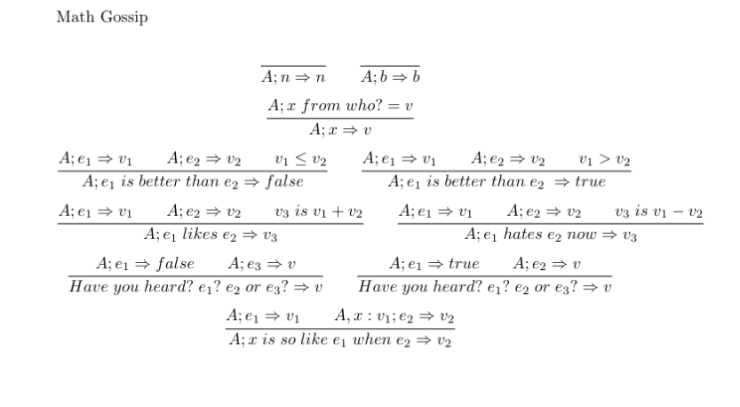

# Discussion 6 Ocaml and OpSem 

## Reminders
1. Project 1 due Today, Tuesday, June 18th 11:59PM
2. Exam Thursday!!!
3. This exercise is due **Wednesday, June 19th 11:59PM**
4. No class/Office hours tomorrow because of Juneteenth!

# Ocaml
## Part 1: Ocaml lists
We can cons. We can append. We can pattern match.

```ocaml
1 :: [2;3] -> [1;2;3] (*cons*)
[2;3;4] @ [0;1] -> [2;3;4;0;1] (*append*)

let rec addone lst = match lst with 
h::t -> h + 1 :: addone t

addone [1;2;3] -> [2;3;4] (*pattern matching*)
```

### Aside: Fold Accumulator

Both `fold_left` and `fold_right` both can take **any type** of accumulator, not just
an `int` or `bool`.

## Part 2: Ocaml Variants

We can now define our own data types. Trees, LinkedLists, Pokemon, etc.

## Ocaml Coding Excercises
Here are some Ocaml coding problems that use lists, fold, and variants.

### List Functions

#### `max_func_chain init funcs`
- **Type**: `'a -> ('a -> 'a) list -> 'a`
- **Description**: This function takes in an initial value and a list of functions, and decides to either apply each function or not to maximize the final return value. For example, if we have a list of functions:
`[funcA; funcB; funcC]` and an initial value `x`, then we take the maximum value
of
   + `x`
   + `funcA(x)`
   + `funcB(funcA(x))`
   + `funcC(funcB(funcA(x)))`
   + `funcC(funcA(x))`
   + `funcB(x)`
   + `funcC(funcB(x))`
   + `funcC(x)`
- **Examples**:
  ```ocaml
  max_func_chain 2 [(fun x -> x + 6)] = 8
  max_func_chain 2 [(fun x -> x + 4); (fun x -> x * 4)] = 24
  max_func_chain 4 [(fun x -> x - 2); (fun x -> x + 10)] = 14
  max_func_chain 0 [(fun x -> x - 1); (fun x -> x * -500); (fun x -> x + 1)] = 501
  max_func_chain "hello" [(fun x -> x ^ "1"); (fun x -> x ^ "2"); (fun x -> x ^ "3")] = "hello3"
   ```

#### `move state symbol transitions`

- **Type**: `int -> char -> (int * char * int)`
- **Description**: Returns a list of states you can move to from `state` on `symbol`, represented by a list of tuples of the form ```(start * symbol * dest)``` Order does not matter.
- **Examples**:
  ```ocaml
  move 1 'a' [(1,'a',2);(1,'a',3);(1,'b',4)] = [2;3]
  ```
### Fold Functions

  #### `evens_odds lst`

- **Type**: `int list -> int * int`
- **Description**: adds all the even numbers in the list and subtracts all the odd numbers (from 0). Return a tuple of (even\_sum,odd\_sum).
- **Examples**:
  ```ocaml
  evens_odds [0;1;2;3;4] = (6,-4)
  ```

#### `fmap f lst`

- **Type**: ('a -> 'b) -> 'a list -> 'b list
- **Description**: Implement Map using only `fold_left` or `fold_right`
- **Examples**:
  ```ocaml
  fmap (fun x -> x + 1) [1;2;3;4] -> [2;3;4;5]
  ```
### Tree Functions

You will do some operations on a binary tree. The tree is defined as follows:
```ocaml
type bintree = Node of bintree * int * bintree | Leaf
```

#### `sum tree`
- **Type**: `bintree -> int`
- **Description**: returns the sum of all nodes in the tree
- **Examples**:
  ``` ocaml
  sum Leaf = 0
  sum Node(Leaf,4,Node(Leaf,5,Leaf)) = 9
  ```

#### `mirror tree`
- **Type**: `bintree -> bintree`
- **Description**: returns the mirror of the tree
- **Examples**:
  ``` ocaml
  mirror Leaf = Leaf
  mirror Node (Node (Leaf, 5, Leaf), 4, Leaf) = Node (Leaf, 4, Node (Leaf, 5, Leaf))
  ```
#### `inorder tree`
- **Type**: `bintree -> int list`
- **Description**: returns a list of values of the nodes in the tree using an inorder traversal
- **Examples**:
  ``` ocaml
  inorder Leaf = []
  inorder Node(Leaf,4,Node(Leaf,5,Leaf)) = [4;5]
  ```

#### `treemap f tree`
- **Type**: `(int -> int) -> bintree -> bintree`
- **Description**: Applies `f` to every node in the `tree`.
- **Examples**:
  ``` ocaml
  treemap (fun x -> x + 1) Leaf = Leaf
  treemap (fun x -> x + 1) Node(Leaf,4,Node(Leaf,5,Leaf)) = Node(Leaf,5,Node(Leaf,6,Leaf))
  ```

## Part 3: Operational Semantics

We define meaning through operations. 

## OpSem Practice

Given the following rules for a language: 



Prove the statements:

- have you heard? 3 is better than 1? a is so like 15 hates 4 now when a is better than 1 or 10 is better than 2 -> true
- x is so like 5 likes 10 when y is so like 20 hates 2 now when x likes y -> 33

