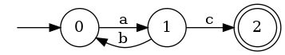

# Project 1: Regular Expression Engine

Due: June 18, 2024 at 11:59 PM (late June 19, *10% penalty*)

Points: 35 public, 35 semipublic, 30 secret

**This is an individual assignment. You must work on this project alone.**

## Overview

In this project you will implement algorithms to work with NFAs, DFAs, and regular expressions. In particular, you will implement `accept` to see whether a string is matched by a NFA; `nfa_to_dfa` to convert an NFA to a DFA using subset construction; `regex_to_nfa` to convert a regular expression to an NFA. You will also implement several other helper functions to assist in these tasks.

The project is broken into two parts: converting an NFA to a DFA; and converting/working with Regular Expressions. All of these parts will be completed in the `fsm.py` file.

### Ground Rules

To begin this project, you will need to commit any uncommitted changes to your local branch and pull updates from the git repository.

This is NOT a pair project. You must work on this project alone as with most other CS projects. See the [Academic Integrity](#academic-integrity) section for more information. 

You may not import anything other than the `re` module.

### Testing
There are three ways to test your project and one order for these tests. First, test locally using the provided public tests. Second, submit to gradescope to see whether you're passing or failing the semipublics. Third, write student tests to best predict what you think our secret tests are.

Running the public tests locally can by done using the command below:
`python3 -m pytest public.py`
This command indicates the number of tests you're failing and why. Feel free to modify the public.py file in order to debug. If you make too many modifications you can always restore to the default state by copying from the git repository.

Submitting to gradescope can be done using the exact same method used for project 0. Add your changes, commit them, push them, then enter the `submit` keyword.

You can write your own student test in an attempt to predict the secret tests. Make a file called student.py. Put tests in this file following the format of the public.py file. Run the same command for running the public test, but replace the file name with the name of your student test file.

### Submitting

First, make sure all your changes are pushed to github using the `git add`, `git commit`, and `git push` commands. You can refer to [my notes](https://bakalian.cs.umd.edu/assets/notes/git.pdf) for assistance. Additionally you can refer to a [testing repo](https://github.com/CliffBakalian/git-basics) I made, but it's recommended you make your own.

Next, to submit your project, you can run `submit` from your project directory.

The `submit` command will pull your code from GitHub, not your local files. If you do not push your changes to GitHub, they will not be uploaded to gradescope.

### Academic Integrity

Please **carefully read** the academic honesty section of the course syllabus. **Any evidence** of impermissible cooperation on projects, use of disallowed materials or resources, or unauthorized use of computer accounts, **will** be submitted to the Student Honor Council, which could result in an XF for the course, or suspension or expulsion from the University. Be sure you understand what you are and what you are not permitted to do in regards to academic integrity when it comes to project assignments. These policies apply to all students, and the Student Honor Council does not consider lack of knowledge of the policies to be a defense for violating them. Full information is found in the course syllabus, which you should review before starting.

## Part 1: NFAs

This first part of the project asks you to implement functions that will help in creating the `nfa_to_dfa` algorithm. In particular, you will be asked to implement the *move* and *epsilon closure* functions [described in class][lecture notes]. You will also implement an `accept` function to determine whether a string is matched by a given NFA; both *move* and *epsilon closure* may be handy here, too.

### FSM class

Before starting, you'll want to familiarize yourself with the class you will be working with

The `Fsm` class is the class representing Finite State Machines. It is modeled after the formal definition of an NFA, a 5-tuple (Σ, Q, q0, F, δ) where:

1. Σ is a finite alphabet,
2. Q is a finite set of states,
3. q0 ∈ Q is the start state,
4. F ⊆ Q is the set of accept states, and
5. δ : Q × (Σ ∪ {ε}) → 𝒫(Q) is the transition function (𝒫(Q) represents the powerset of Q).

We translate this definition into a Python class in a straightforward way using object oriented programming:

```python
class Fsm:
  def __init__(self,alphabet,states,start,final,transitions):
    self.sigma = alphabet
    self.states = states
    self.start = start
    self.final = final
    self.transitions = transitions
```

A single transition in the `transition` instance variable of the Fsm class is in the form of a 3-tuple. For example:

```python
(0, 'c', 1)  #Transition from state 0 to state 1 on character 'c'
(1, None, 0) #Transition from state 1 to state 0 on epsilon
```
These transitions are combined into a list in the Fsm class.

While the formal definition of a transition is a function which maps a state and character to a set of states, we will define transitions as 3-tuples so that each edge in the NFA will correspond to a single transition in the list of transitions. This will make the syntax for defining NFAs cleaner, and allows for a one-to-one mapping between elements of the transition list and edges in the NFA graph.

We also provide a `__str__` method for the class to help with debugging and seeing the actual values when you want to print your Finite State Machines.

An example NFA would be:

```python
nfa_ex = Fsm(['a'], [0, 1, 2], 0, [2], [(0, 'a', 1),(1, None, 2)])
```

This looks like:


Here is a DFA:

```python
nfa_ex = Fsm(['a','b','c'], [0, 1, 2], 0, [2], [(0, 'a', 1), (1, 'b', 0), (1, 'c', 2)])
```

This looks like:



### Functions

Here are the functions you must implement:

#### `move(c,s,nfa)`
- **Description**: This function takes as input an NFA(`nfa`), a set of initial states(`s`), and a symbol(`c`). The output will be the set of states (represented by a list) that the NFA might be in after making one transition on the symbol (or epsilon if `None`), starting from any of the initial states. It means starting from any of the initial states, where it can go to after it makes one transition on the symbol if the symbol is not `None`; otherwise it will just take an epsilon transition. If the symbol is not in the alphabet `sigma`, then return an empty list.

- **Examples**:

  ```python
  move(nfa_ex,[0],'a') = [1] #nfa_ex is the NFA defined above
  move(nfa_ex,[1],'a') = []
  move(nfa_ex,[2],'a') = []
  move(nfa_ex,[0;1],'a')  = [1]
  move(nfa_ex,[1],None) = [2]
  ```

- **Explanation**:
  1. Move on `nfa_ex` from `0` with `a` returns `[1]` since from 0 to 1 there is a transition with character `a`.
  2. Move on `nfa_ex` from `1` with `a` returns `[]` since from 1 there is no transition with character `a`.
  3. Move on `nfa_ex` from `2` with `a` returns `[]` since from 2 there is no transition with character `a`.
  4. Move on `nfa_ex` from `0` and `1` with `a` returns `[1]` since from 0 to 1 there is a transition with character `a` but from 1 there was no transition with character `a`.
  5. Notice that the NFA uses an implicit dead state. If `s` is a state in the input list and there are no transitions from `s` on the input character, then all that happens is that no states are added to the output list for `s`.
  6. Move on `nfa_ex` from `1` with `None` returns `[2]` since from 1 to 2 there is an epsilon transition.

#### `e_closure(s,nfa)`
- **Description**: This function takes as input an NFA(`nfa`) and a set of initial states(`s`). It outputs a set of states that the NFA might be in after making zero or more epsilon transitions, starting from the initial states. You can assume the intial states are valid (ie a subset of the nfa's states).
- **Examples**:

  ```python
  e_closure(nfa_ex,[0]) = [0]
  e_closure(nfa_ex,[1]) = [1;2]
  e_closure(nfa_ex,[2])  = [2]
  e_closure(nfa_ex,[0;1]) = [0;1;2]
  ```

- **Explanation**:
  1. e_closure on `nfa_ex` from `0` returns `[0]` since there is no where to go from `0` on an epsilon transition.
  2. e_closure on `nfa_ex` from `1` returns `[1;2]` since from `1` you can get to `2` on an epsilon transition.
  3. e_closure on `nfa_ex` from `2` returns `[2]` since there is no where to go from `2` on an epsilon transition.
  4. e_closure on `nfa_ex` from `0` and `1` returns `[0;1;2]` since from `0` you can only get to yourself and from `1` you can get to `2` on an epsilon transition but from `2` you can't go anywhere.

#### `accept nfa s`
- **Description**: This function takes an NFA and a string, and returns whether the NFA accepts the string.
- **Examples**:

  ```python
  accept(dfa_ex,"") = false  # dfa_ex is the DFA defined above
  accept(dfa_ex,"ac") = true
  accept(dfa_ex,"abc") = false
  accept(dfa_ex,"abac") = true
  ```

- **Explanation**:
  1. accept on `dfa_ex` with the string "" returns `false` because initially we are at our start state 0 and there are no characters to exhaust and we are not in a final state.
  2. accept on `dfa_ex` with the string "ac" returns `true` because from 0 to 1 there is an 'a' transition and from 1 to 2 there is a 'c' transition and now that the string is empty and we are in a final state thus the nfa accepts "ac".
  3. accept on `dfa_ex` with the string "abc" returns `false` because from 0 to 1 there is an 'a' transition but then to use the 'b' we go back from 1 to 0 and we are stuck because we need a 'c' transition yet there is only an 'a' transition. Since we are not in a final state thus the function returns false.
  4. accept on `dfa_ex` with the string "abac" returns `true` because from 0 to 1 there is an 'a' transition but then to use the 'b' we go back from 1 to 0 and then we take an 'a' transition to go to state 1 again and then finally from 1 to 2 we exhaust our last character 'c' to make it to our final state. Since we are in a final state thus the nfa accepts "abac".

Our goal now is to implement the `nfa_to_dfa` function with the helper functions we created earlier. It uses the subset construction to convert an NFA to a DFA. For help with understanding Subset Construction you can look at the [lecture notes][lecture notes] and [here][subset construct]. We recommend you implement `move` and `e_closure` before starting working on the NFA to DFA algorithm, since they are used in the subset construction.

Remember that every DFA is also an NFA, but the reverse is not true. The subset construction converts an NFA to a DFA by grouping together multiple NFA states into a single DFA state. Notice that our states are now sets of states from the NFA. The description will use "dfa state" to mean a set of states from corresponding NFA.

#### `nfa_to_dfa(nfa)`
- **Description**: This function takes as input an NFA(`nfa`) and converts it to an equivalent DFA. The language recognized by an NFA is invariant under `nfa_to_dfa`. In other words, for all NFAs `nfa` and for all strings `s`, `accept nfa s = accept (nfa_to_dfa nfa) s`.

## Part 2: Regular Expressions
For the last part of the project, you will implement code which builds an NFA from a regular expression. The `Regexp` module represents a regular expression with the type `regexp_t`:

This datatype represents regular expressions as follows:

-  `Empty_String` represents the regular expression recognizing the empty string (not the empty set!). Written as a formal regular expression, this would be `epsilon`.

-  `Char c` represents the regular expression that accepts the single character c. Written as a formal regular expression, this would be `c`.

-  `Union (r1, r2)` represents the regular expression that is the union of r1 and r2. For example, `Union(Char 'a', Char'b')` is the same as the formal regular expression `a|b`.

-  `Concat (r1, r2)` represents the concatenation of r1 followed by r2. For example, `Concat(Char 'a', Char 'b')` is the same as the formal regular expresion `ab`.

-  `Star r` represents the Kleene closure of regular expression r. For example, `Star (Union (Char 'a', Char 'b'))` is the same as the formal regular expression `(a|b)*`.

Here are the functions you must implement:

#### `def char(string):` 
**Type**: `String -> nfa_t`
-  **Description**: Takes in a string and returns an nfa which describes the transition associated with the string.

#### `def concat(nfa1, nfa2):`
**Type**: `nfa_t -> nfa_t -> nfa_t`
-  **Description**: Takes in two nfa's and returns a new nfa which is the union of the two nfa arguments.

#### `def union(nfa1, nfa2):`
**Type**: `nfa_t -> nfa_t -> nfa_t`
-  **Description**: Takes in two nfa's and returns a new nfa which is the concatenation of the two nfa arguments.

#### `def star(nfa):`
  **Type**: `nfa_t -> nfa_t`
-  **Description**: Takes in an nfa and returns a new nfa which has the kleene closure applied to it.

[list doc]: https://caml.inria.fr/pub/docs/manual-ocaml/libref/List.html
[string doc]: https://caml.inria.fr/pub/docs/manual-ocaml/libref/String.html
[modules doc]: https://realworldocaml.org/v1/en/html/files-modules-and-programs.html
[subset construct]: https://bakalian.cs.umd.edu/assets/notes/FA.pdf
[lecture notes]: https://bakalian.cs.umd.edu/330
[pervasives doc]: https://caml.inria.fr/pub/docs/manual-ocaml/libref/Stdlib.html
[git instructions]: ../git_cheatsheet.md
[wikipedia inorder traversal]: https://en.wikipedia.org/wiki/Tree_traversal#In-order
[submit server]: https://submit.cs.umd.edu
[web submit link]: image-resources/web_submit.jpg
[web upload example]: image-resources/web_upload.jpg
[sets]: ./SETS.md
