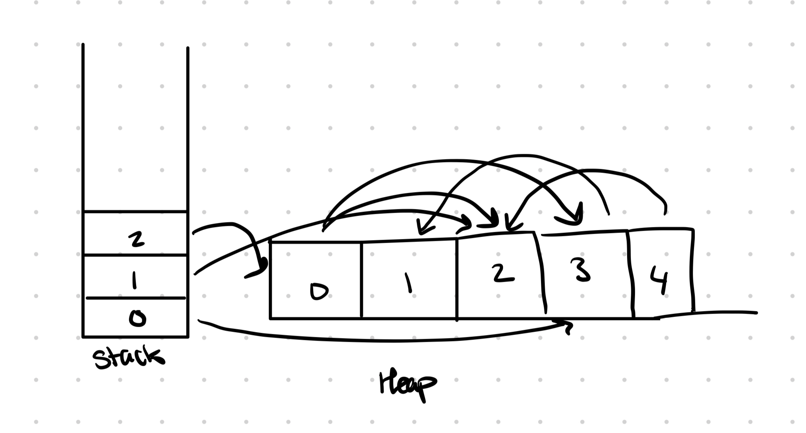
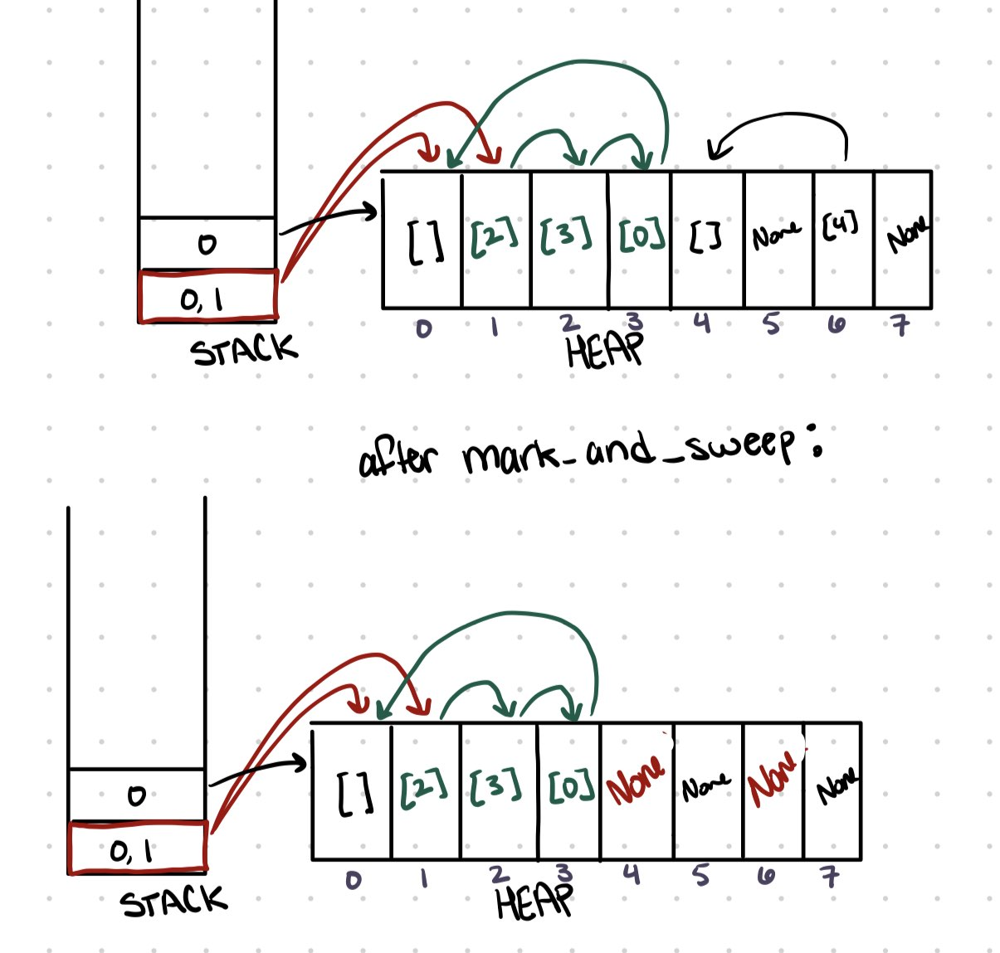
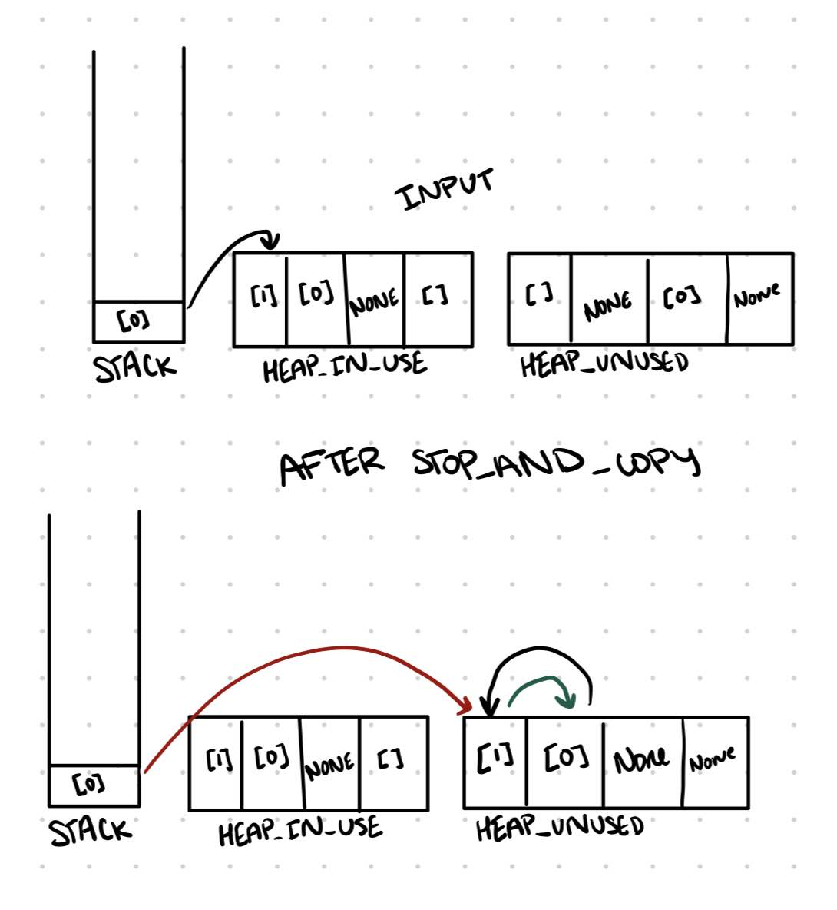

# Project 3: Garbage Collector

>[!IMPORTANT]
> **Due**: July 16th
> 
> **Points**: Public: 50, Semipublic: 50

## Introduction
In this project, we will be implementing a version of the mark and sweep and a version of stop and copy garbage collection. See [Cliff's notes](https://bakalian.cs.umd.edu/assets/notes/gc.pdf) for more details about these forms of garbage collection.

### Ground Rules

This is an individual assignment. You may use functions found in Rust's standard
library. You may write any helper functions that you wish. 
You may not use `unsafe`.

### Testing and Submitting

Like OCaml, Rust uses the `build` and `test` commands. However, rather than
`dune`, we use `cargo`.


 - To build your project, run `cargo build`.
 - To run the public tests, run `cargo test`.
 - To get suggestions on various ways to improve your code, run `cargo clippy`.
 - To format your code, run `cargo fmt`.

When running tests, you will see a list of tests, and whether or not you passed: 
```rust 
test test_example1 ... ok
test test_example2 ... ok
test test_example3 ... FAILED
test test_example4 ... ok
test test_example5 ... FAILED
```

`ok` means you passed. Good job! `FAILED` means that there is an issue. If this
is the case, you will see an output beneath the failed test: 

```rust
---- test_gauss stdout ----
thread 'test_example3' panicked at tests/public.rs:9:5:
assertion `left == right` failed
  left: Some(2)
 right: Some(1)
note: run with `RUST_BACKTRACE=1` environment variable to display a backtrace
```

`right` is YOUR output. `left` is the EXPECTED output.

<!-- For this project, the public tests are included as unit tests in the bottom of your lib.rs file.

Rust also supports documentation tests. We have included one example above `gauss()`. These are tests within the comments above functions.
The Rust Book is a great resource if you would like more information about [how document/unit tests work](https://doc.rust-lang.org/stable/cargo/commands/cargo-test.html).

You may add additional unit and documentation tests as you wish, the autograder uses a copy of the original publics. 
You can use the doctest example in `gauss()` or the example `student_test1()` function to see the syntax. -->

<!-- > [!IMPORTANT]
> `cargo test` automatically runs **all** documentation *and* unit tests -->


Rust does not have a toplevel repl similar to `utop`, but you can try your Rust code online at <https://play.rust-lang.org/>.


Remember that Rust has print statements that will appear in the console.
You may wish to take advantage of these for debugging:

- [`println!`](https://doc.rust-lang.org/std/macro.println.html)/[`eprintln!`](https://doc.rust-lang.org/std/macro.eprintln.html)
- [`dbg!`](https://doc.rust-lang.org/std/macro.dbg.html)'

<!-- If you liked using `gdb` or `lldb` with C code in CMSC216, those also work with Rust.
Follow [this guide](https://blog.logrocket.com/debugging-rust-apps-with-gdb/#rustgdbexample). -->

>[!NOTE]
> Implement the following functions in lib.rs in your src directory

## Mark and Sweep

`pub fn mark_and_sweep(stack: &[Option<&[u32]>], heap: &mut[Option<&[u32]>]) -> ()`

Given a Stack and a Heap (represented by [slices](https://doc.rust-lang.org/book/ch04-03-slices.html)), your job is to perform the Mark and Sweep garbage collection on the Heap. This is to be done **in place**, meaning that your function will modify the slice (representing the heap) that is passed in rather than creating and returning a new one.

As stated above, the stack and heap are represented by slices with each index (a `[u32] Option` type) representing a memory address. For example:

- Stack: `[Some([3]), Some([2]), Some([0])]`
- Heap: `[Some([3, 2]), Some([]), Some([]), Some([1]), Some([2])]`

Represents a memory diagram that appears as follows: 

**Important Note**: The stack will always be the length of however many programs there are (there will never be a `None` in the stack). However, the stack **may** contain empty lists (some programs don't reference data on the heap at all).

The stack and heap are labeled by their indicies in the slice. The information inside them is the memory that they point to on the heap. 

`None` indicates that there is no memory present there in the heap. Freed memory will appear as none. `[]` represents memory that is used, but doesn't point to any other pieces of memory. You may assume nothing in the stack or heap will point to freed memory (None).

Another example of the memory diagrams: 
- Stack: `[Some([0,1]), Some([0])]`
- Heap: `[Some([]), Some([2]), Some([3]), Some([0]), Some([]), None, Some([4]), None]`

After calling mark and sweep: 
- Stack `[Some([0,1]), Some([0])]`
- Heap: `[Some([]), Some([2]), Some([3]), Some([0]), None, None, None, None]`

Diagrams: 


Examples:
```rust
    let mut input:[Option<&[u32]>; 4] = [Some(&[]), Some(&[]), Some(&[]), Some(&[])];
    let expected:[Option<&[u32]>; 4] = [None, Some(&[]), None, Some(&[])];
    mark_and_sweep(&[Some(&[1,3])], &mut input);
    assert_eq!(expected, input); 


    let mut input:[Option<&[u32]>; 4] = [Some(&[1]), Some(&[0]), Some(&[]), Some(&[])];
    let expected:[Option<&[u32]>; 4] = [None, None, None, Some(&[])];
    mark_and_sweep(&[Some(&[3])], &mut input);
    assert_eq!(expected, input); 
```

## Stop and Copy

`pub fn stop_and_copy (stack: &[Option<&[u32]>], heap_in_use: &mut[Option<&[u32]>], heap_unused: &mut[Option<&[u32]>]) -> ()`

Stop and Copy tries to solve the problem of fragmentation. In this function, you are given two "heap" variables, one to represent each half of the heap. One ("heap_in_use") is currently in use at the time the program was "stopped" (i.e. when your function is executing). The other ("heap_unused") is where the new data is to be copied. 

**Both may have data inside. Leave the data inside the heap_in_use and overwrite the data in heap_unused to avoid extra overhead.**

You must copy all the data in the heap that is pointed to, like in mark and sweep, into heap_unused. It must be contiguous, starting from the left (beginning) of the slice. 

The used memory can be in any order, as long as the above conditions are met.

The stack and heap are represented the same way that they are in mark and sweep, just with 2 halves of a heap represented. You will again have to modify `heap_unused` in place. This function does not return anything.


Examples:
```rust

    let mut input_in_use:[Option<&[u32]>; 4] = [Some(&[1]), Some(&[0]), None, Some(&[])];
    let mut input_unused:[Option<&[u32]>; 4] = [Some(&[]), None, Some(&[0]), None];
    stop_and_copy(&[Some(&[0])], &mut input_in_use, &mut input_unused);
    // Now input_unused should == [Some(&[0]), Some(&[1]), None, None]
    // input_in_use should stay the same
```

Diagram of above example: 

